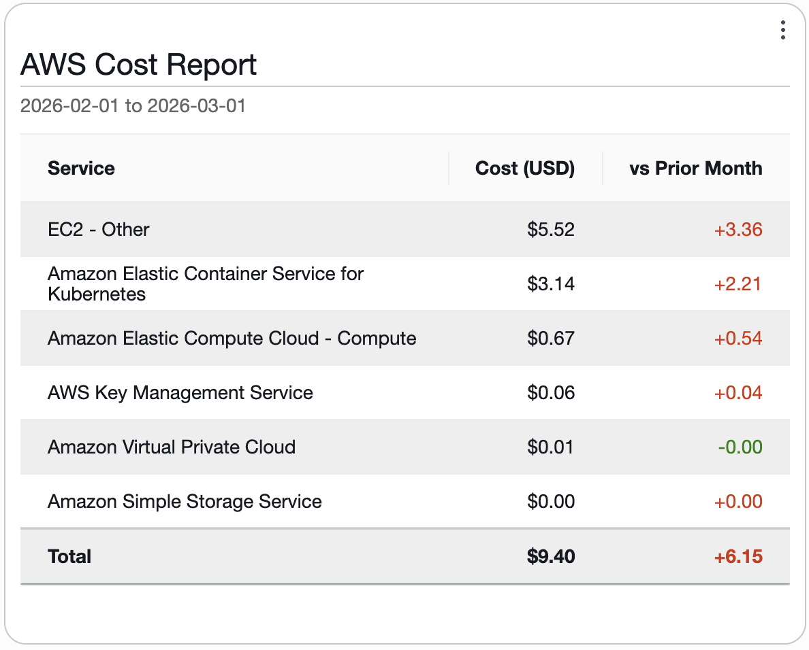

# CloudWatch custom widget Lambda to display cost on dashboards

<!-- BEGIN_TF_DOCS -->
## Requirements

| Name | Version |
|------|---------|
|  [terraform](#requirement\_terraform) | >= 1.0 |
|  [aws](#requirement\_aws) | ~> 6 |

## Providers

| Name | Version |
|------|---------|
|  [aws](#provider\_aws) | ~> 6 |

## Modules

| Name | Source | Version |
|------|--------|---------|
|  [widget](#module\_widget) | terraform-aws-modules/lambda/aws | 8.5.0 |

## Resources

| Name | Type |
|------|------|
| [aws_iam_policy_document.lambda_execution](https://registry.terraform.io/providers/hashicorp/aws/latest/docs/data-sources/iam_policy_document) | data source |

## Inputs

| Name | Description | Type | Default | Required |
|------|-------------|------|---------|:--------:|
|  [cost\_allocation\_tag\_key](#input\_cost\_allocation\_tag\_key) | Cost allocation tag key to filter cost data (e.g., 'Environment') | `string` | n/a | yes |
|  [cost\_allocation\_tag\_values](#input\_cost\_allocation\_tag\_values) | List of cost allocation tag values to filter cost data (e.g., ['Production', 'Staging']) | `list(string)` | n/a | yes |
|  [log\_level](#input\_log\_level) | Log level for the Lambda function (e.g., DEBUG, INFO, WARNING, ERROR, CRITICAL) | `string` | `"INFO"` | no |
|  [project\_name](#input\_project\_name) | Name of the project, used for naming the Lambda function and related resources | `string` | `"cw-cost-widget"` | no |
|  [show\_current\_month](#input\_show\_current\_month) | Show current month MTD costs instead of the last complete month | `bool` | `false` | no |
|  [tags](#input\_tags) | Tags to apply to all resources | `map(string)` | `{}` | no |

## Outputs

| Name | Description |
|------|-------------|
|  [lambda\_cloudwatch\_log\_group\_name](#output\_lambda\_cloudwatch\_log\_group\_name) | The name of the CloudWatch log group for the Lambda function |
|  [lambda\_function\_arn](#output\_lambda\_function\_arn) | The ARN of the CloudWatch custom widget Lambda function |
|  [lambda\_function\_name](#output\_lambda\_function\_name) | The name of the CloudWatch custom widget Lambda function |
|  [lambda\_role\_arn](#output\_lambda\_role\_arn) | The ARN of the IAM role attached to the Lambda function |
<!-- END_TF_DOCS -->
